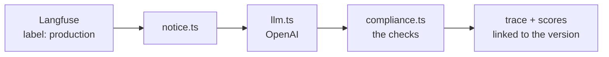
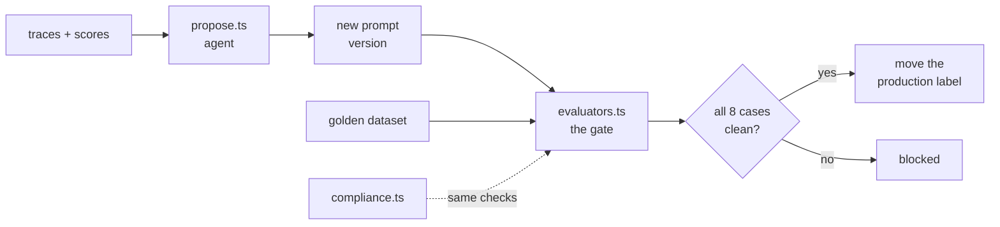

# Adverse Action Notice Copilot

**A starter-kit for treating LLM prompts as governed, deployable artifacts — built on [Langfuse](https://langfuse.com) Prompt Management.**

The demo app writes ECOA / Regulation B adverse action notices (credit decline
letters). That text is legally mandated, so its prompt isn't a string in the
codebase — it's production configuration *and* a security control. This repo
shows how to version it, gate it on an eval suite, deploy it by moving a label,
and roll it back in one move.

Small enough to read in twenty minutes. Specific enough to fork.

---

## Quickstart

```bash
npm install
cp .env.example .env     # Langfuse + OpenAI keys
npm run seed             # publishes prompt v1 + an 8-case golden dataset
npm run doctor           # verifies keys, connectivity, label, dataset
npm run notice           # generate a notice through the managed prompt
```

Needs a [Langfuse](https://cloud.langfuse.com) project (free tier, or
[self-hosted](https://langfuse.com/self-hosting) — set `LANGFUSE_BASE_URL`) and an
[OpenAI key](https://platform.openai.com/api-keys).

> **Point it at an empty Langfuse project.** `npm run reset` deletes *every
> version* of the prompt.

No OpenAI key yet? `MOCK_LLM=1 npm run experiment` runs the whole pipeline
against a deterministic stand-in — no spend, no key.

---

## What it does

Five commands tell the whole story.

| | Command | What you see |
|---|---|---|
| **0** | `npm run legacy` | The prompt as a template literal — and the internal decision record sitting in the model's context with one sentence guarding it. |
| **1** | `npm run serve` | A live page on `:4321` serving the prompt by label, with a version badge. |
| **2** | `npm run experiment` | Two versions scored across the golden dataset. The gate catches a revision that takes five checks from failing to perfect and starts disclosing an internal threshold. |
| **3** | `npm run promote -- --version 3` | Deploy by moving a label. The running server follows within the cache TTL — no restart. |
| **4** | `npm run propose` | An agent reads production scores, publishes a `candidate`, runs the same gate — and cannot promote. |

`npm run ci` is step 2 with an exit code.

---

## How it works

**Serving.** Every request fetches the prompt by label. `notice.ts` holds no
prompt text, no model name, no thresholds — all of it arrives from the prompt
version, and the resulting trace is linked back to that version.



**Changing.** A new version ships because it cleared the gate, not because
someone merged it — and the gate runs the same `compliance.ts` the runtime does,
so there is no second, drifting definition of "compliant." Production scores are
what the agent reads to propose the next version, which then faces the same gate.



---

## Structure

```
prompts/*.json          prompt versions as reviewable seeds
data/golden-cases.json  8 declined applications that gate every change

src/
  notice.ts             >> THE SERVING PATH — read this first
  evaluators.ts         the gate: 100% pass rate or no promotion
  domain/
    compliance.ts       >> THE CHECKS — runtime, evals and CI, one source
    types.ts            ApplicationCase, ReasonCode, CreditScoreDisclosure
  llm.ts                OpenAI Responses API + the MOCK_LLM stand-in
  instrumentation.ts    OpenTelemetry + LangfuseSpanProcessor, PII mask hook
  cli/                  one file per command
```

Two files carry the idea: **`src/notice.ts`** for what it *doesn't* contain, and
**`src/domain/compliance.ts`** because it is the gate.

<details>
<summary><strong>All commands</strong></summary>

```
npm run doctor                          pre-flight: keys, connectivity, label, dataset
npm run seed                            create the prompt and the golden dataset
npm run reset -- --yes                  delete all versions, republish v1 (destructive)

npm run legacy                          the hardcoded "before" state
npm run notice                          generate one notice (--case, --version, --label)
npm run serve                           live page on :4321 (--port)

npm run draft -- optimised              publish v2, the plausible-but-broken fix
npm run draft -- compliant              publish v3, the correct fix

npm run experiment                      score production + candidate (--versions 1,2,3)
npm run promote -- --version 3          run the gate, then move the production label
npm run promote -- --version 1 --force  rollback, skipping the gate
npm run versions                        audit view: versions, labels, commit messages

npm run propose                         agent proposes a revision (--hours, --no-gate)
npm run ci -- --label candidate         the same gate, with an exit code
npm run typecheck
```

</details>

---

## Resources

**Prompt management**
[Overview](https://langfuse.com/docs/prompt-management/overview) ·
[Versions & labels](https://langfuse.com/docs/prompt-management/features/prompt-version-control) ·
[Config](https://langfuse.com/docs/prompt-management/features/config) ·
[Linking to traces](https://langfuse.com/docs/prompt-management/features/link-to-traces) ·
[Caching](https://langfuse.com/docs/prompt-management/features/caching) ·
[Fallbacks](https://langfuse.com/docs/prompt-management/features/guaranteed-availability)

**Evaluation**
[Experiments via SDK](https://langfuse.com/docs/evaluation/experiments/experiments-via-sdk) ·
[Experiments in CI/CD](https://langfuse.com/docs/evaluation/experiments/experiments-ci-cd) ·
[Writing good evaluators](https://langfuse.com/academy/evaluate/writing-evaluators) ·
[LLM-as-a-judge](https://langfuse.com/docs/evaluation/evaluation-methods/llm-as-a-judge)

**Regulated deployments**
[Langfuse for financial services](https://langfuse.com/financial-services) ·
[Self-hosting](https://langfuse.com/self-hosting) ·
[Agent skill](https://langfuse.com/docs/api-and-data-platform/features/agent-skill) ·
[`llms.txt`](https://langfuse.com/llms.txt)

**Context**
[OWASP Top 10 for LLM Applications](https://genai.owasp.org/llm-top-10/) — `LLM08:2026` Hidden Context Exposure ·
[12 CFR 1002.9](https://www.ecfr.gov/current/title-12/part-1002/section-1002.9) — Reg B notification requirements

---

## Your next step

**Just cloned it?** Run the five commands above in order. The one that matters is
`npm run experiment` — watch a revision take five checks from failing to perfect
and fail anyway. That's the whole argument in thirty seconds.

**Want it in your codebase this week?**

1. **Inventory your prompts.** Every string literal that reaches a customer or a
   regulator.
2. **Write down what they must never disclose.** That list is your
   `neverDisclose` manifest, and you probably don't have one.
3. **Move one prompt** — your highest-risk one — behind a `production` label.
4. **Build a ten-case dataset** from real traffic, including the two cases that
   have already embarrassed you.
5. **Put the gate in CI and make it required.** The day it blocks a merge is the
   day this stops being a demo.

**Adapting it?** `src/domain/compliance.ts` is the file to rewrite — every
regulated domain needs its own checks, and they're the part nobody can write for
you. [`CONTRIBUTING.md`](./CONTRIBUTING.md) has the recipe, including the rule
that matters: a new check needs a golden case that *fails* it, or it's
unfalsifiable.

---

MIT licensed — see [`LICENSE`](./LICENSE). Not legal advice: the regulatory
requirements modelled here are simplified, and the creditor, applicants and
reason codes are fictional.
